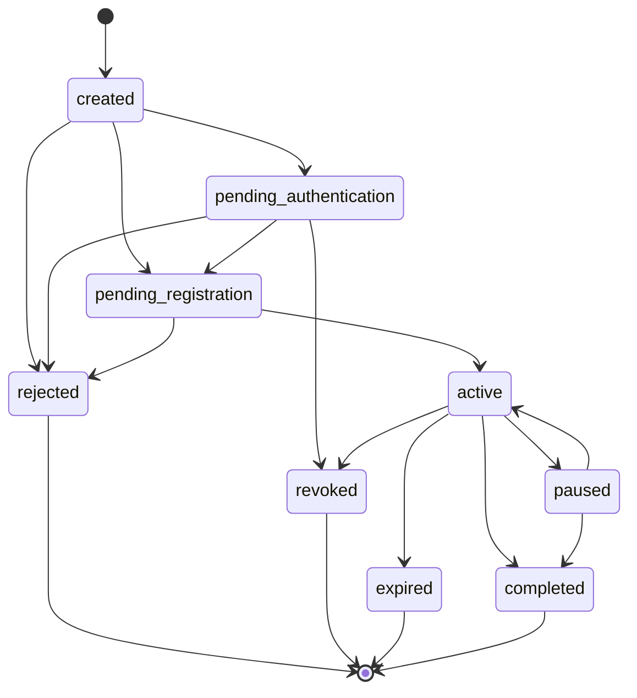

# aadesh

[](https://www.npmjs.com/package/@saiprasad4/aadesh)
[](https://github.com/saiprasad4/aadesh/actions/workflows/ci.yml)
[](https://www.npmjs.com/package/@saiprasad4/aadesh)
[](https://www.npmjs.com/package/@saiprasad4/aadesh?activeTab=dependencies)
[](https://bundlephobia.com/package/@saiprasad4/aadesh)
[](./LICENSE)

**Model the Indian recurring-payment mandate lifecycle... eNACH + UPI Autopay... in one typed, zero-dependency library.**

Normalize raw bank/NPCI/PSP error codes to consistent, **money-safe** handling, drive the mandate and single-debit state machines, and decide retries under the RBI/NPCI rules.

> _aadesh_ (आदेश)... "mandate / directive".

---

## Why

Recurring payments in India fail often, and the failure rate keeps climbing:

- NACH e-mandate **rejection rates have climbed to ~55%** (from ~28% in 2017-18).[^1]
- UPI Autopay sees **20 million+ mandates revoked monthly** for insufficient balance alone, against a base on the order of **~120 million recurring debits a month**.[^2]
- Every failed debit carries a bank return charge, commonly **₹250-500 + 18% GST**, plus involuntary churn.[^3]

Every fintech re-implements the same fragile logic against a moving target of NPCI circulars: hundreds of return and decline codes across five layers (app, PSP, sponsor bank, destination bank, NPCI), two structurally different rails, retry caps and windows that change by circular. `aadesh` is that logic, modelled once, conservatively, and kept in the open.

It is deterministic and dependency-free. It runs on your server or on-device, makes no network calls, and never touches payment data.

## Install

```bash
npm install @saiprasad4/aadesh
```

## Quickstart

```ts
import { getErrorCode, decideRetry, MandateMachine } from '@saiprasad4/aadesh';

// 1. Understand a failure... normalized handling, not a raw code lookup.
const err = getErrorCode('AP02', { rail: 'enach' }); // eNACH return code
//   { category: 'account_closed', retriable: false, terminal: true,
//     customerMessage: 'The linked bank account is closed...', suggestedAction: ... }

// 2. Decide whether to retry... conservative by default (see below).
const decision = decideRetry({ rail: 'upi_autopay', attemptsSoFar: 1, errorCode: 'IE' });
//   { retry: true, attemptsRemaining: 2, notBefore: <Date>, reason: ... }   // IE = insufficient funds

// 3. Drive the mandate lifecycle as a real state machine (illegal jumps throw).
const mandate = new MandateMachine();      // 'created'
mandate.transition('pending_authentication');
mandate.transition('pending_registration');
mandate.transition('active');
```

### Safety is the point

`aadesh` refuses to make dangerous money decisions for you:

```ts
// A suspected-fraud decline is NEVER auto-retried.
decideRetry({ rail: 'upi_autopay', attemptsSoFar: 1, errorCode: '59' });
//   { retry: false, reason: 'Terminal error (suspected_fraud): ...', attemptsRemaining: 0 }

// An OTP lockout is NOT auto-retried (retrying extends the lock).
decideRetry({ rail: 'upi_autopay', attemptsSoFar: 1, errorCode: 'Z6' });
//   { retry: false, reason: 'Non-retriable error (authentication_locked): ...' }

// A code we don't recognize is NOT auto-retried... we refuse to guess with money.
decideRetry({ rail: 'upi_autopay', attemptsSoFar: 1, errorCode: 'SOME_NEW_CODE' });
//   { retry: false, reason: 'Unrecognized code ... not auto-retried ...' }

// A success code is classified as success... never rendered as a failure.
getErrorCode('00')?.category; // 'success'
```

Only categories where a retry is genuinely safe and likely to succeed... insufficient funds, transient bank/network faults, a single bad OTP... are auto-retriable. Everything ambiguous, permanent, fraud-flagged, or locked stops and hands the decision back to you.

## What it does

| Module | What it does |
|---|---|
| **Error-code dictionary** | `getErrorCode`, `handlingFor`, `isRetriable`, `isTerminal`... collapse raw bank/NPCI/PSP codes to a normalized category with consistent, conservative handling. Cross-rail collisions throw rather than guess. |
| **State machines** | `MandateMachine` (registration) and `DebitMachine` (single debit) with explicit, inspectable transition tables. Illegal transitions throw; the debit machine enforces the mandatory pre-debit notice. |
| **Retry policy** | `decideRetry`... composes success/terminal/unknown handling, the rail's attempt cap (UPI Autopay 1+3), and retry spacing into one money-safe decision. |
| **Rail profiles** | `getRailProfile`... the operational rules of each rail (settlement, attempt cap, pre-debit notice, AFA limits) as frozen, readable data. |
| **Reconciliation** | `reconcile`... match the outcomes a bank/PSP reported back to the attempts you made, catch the async-return-vs-retry race before it becomes a double debit, and flag reversals, amount mismatches and stuck debits. |

## Reconciliation

The retry policy decides whether to try again. Reconciliation decides what actually happened, which is the harder half. It matters most on eNACH, where a return can land T+n, in a file, *after* you have already scheduled a retry. Matching that late success back to the original attempt, and suppressing the now-redundant retry, is where double debits are actually prevented.

`reconcile` takes the debit attempts you made and the outcomes you have received, groups attempts into logical debits by a `debitKey` (your idempotency key), and classifies each one conservatively:

```ts
import { reconcile } from '@saiprasad4/aadesh';

const report = reconcile({
  attempts: [
    { attemptId: 'a1', debitKey: 'mandate42:2026-07', rail: 'enach', amountPaise: 50000, attemptNumber: 1, presentedAt: day0 },
    { attemptId: 'a2', debitKey: 'mandate42:2026-07', rail: 'enach', amountPaise: 50000, attemptNumber: 2, presentedAt: day1 }, // the retry
  ],
  // The original attempt's success arrives late, after the retry was already presented.
  outcomes: [{ attemptId: 'a1', rail: 'enach', amountPaise: 50000, rawCode: '0', reportedAt: day1 }],
});

report.debits[0].status;            // 'double_debit_risk'
report.debits[0].handling.suppressRetry; // true  ... cancel a2 before it also settles
report.suppressRetryKeys;           // ['mandate42:2026-07']
```

The status is deliberately dangerous-first. `double_debit_confirmed` (two settlements, a reversal is owed) and `double_debit_risk` (one success while another attempt is still open) come before `settled` and `failed`, and anything that cannot be proven settled... an unrecognized code, an amount that does not match, an outcome past the rail's return window... leans to `needsReview` and `suppressRetry` rather than guessing with money. Amounts are integer paise throughout; floats and negatives are rejected.

## Compliance

The state machine tells you what state a mandate is in. The compliance layer tells you what the RBI rules let you do with it, driven off the same rail profiles so the thresholds live in one place. It encodes the RBI Digital Payments E-mandate Framework, 2026.

`checkDebitLimits` answers whether a debit needs an Additional Factor of Authentication and whether it is within the mandate cap. No AFA is needed up to ₹15,000, or up to ₹1,00,000 for the eligible merchant categories (mutual funds, insurance, card bills), which you signal by MCC. The ceiling is inclusive, and amounts are integer paise.

```ts
import { checkDebitLimits } from '@saiprasad4/aadesh';

checkDebitLimits({ rail: 'upi_autopay', amountPaise: 2_000_000 }).afaRequired;          // true  (₹20,000, over the ₹15,000 line)
checkDebitLimits({ rail: 'upi_autopay', amountPaise: 5_000_000, mcc: '6300' }).afaRequired; // false (₹50,000 insurance, under ₹1,00,000)
```

`planPreDebitNotification` works back from a debit to the 24-hour notification deadline, and `isPreDebitNotificationTimely` checks a notice you actually sent against it. FASTag and NCMC auto-recharges are exempt.

```ts
import { planPreDebitNotification } from '@saiprasad4/aadesh';

const plan = planPreDebitNotification({ rail: 'upi_autopay', debitAt: new Date('2026-03-15T10:00:00Z') });
plan.sendBy;         // 2026-03-14T10:00:00Z ... notify by here or you are non-compliant
plan.requiredFields; // ['amount', 'debitDate', 'merchantName', 'mandateReference', 'reason']
```

`debitSchedule` computes the debit dates in a window from the frequency and anchor day, clamping a day-31 anchor to the last day of shorter months. `upcomingDebits` pairs each debit with its notification deadline, which is the whole flow in one call. `as_presented` mandates return nothing, since a variable, merchant-initiated debit cannot be precomputed.

```ts
import { upcomingDebits } from '@saiprasad4/aadesh';

upcomingDebits(
  { frequency: 'monthly', startDate: new Date('2026-01-15T00:00:00Z') },
  { from: new Date('2026-01-01T00:00:00Z'), to: new Date('2026-03-31T00:00:00Z') },
  'upi_autopay',
);
// [{ debitAt: 2026-01-15, notifySendBy: 2026-01-14 }, { debitAt: 2026-02-15, notifySendBy: 2026-02-14 }, ...]
```

## Rails

`aadesh` models two rails behind one vocabulary:

| | `upi_autopay` | `enach` |
|---|---|---|
| Settlement | real-time | batch (T+1...T+n) |
| Attempt cap | 4 (1 + 3) | 3... *sponsor-bank dependent, unverified* |
| Pre-debit notice | 24h | 24h |
| No-AFA limit | ₹15,000 | ₹15,000 |
| Higher no-AFA limit | ₹1,00,000 (MF / insurance / card-bill MCCs) | ₹1,00,000 (same MCCs) |

Profiles are frozen data... spread one into your own object to override for a sponsor-bank agreement or a newer circular.

## Mandate lifecycle



## Data provenance

The error-code dataset (~298 codes across eNACH and UPI Autopay) is compiled from public sources and versioned. Each entry carries a `verified` flag and a `source`.

- **Primary sources:** NPCI UPI Error & Response Codes (v2.9), NPCI circular NACH-006-FY-24-25 (revised e-mandate rejection codes), NPCI/UPI/OC-151A (the ₹1L no-AFA MCC list), and the RBI Digital Payments E-mandate Framework, 2026.
- **Aggregators (secondary/corroborating):** Decentro and TaxGuru, which republish the NPCI code tables.
- **Vendor overlay:** a small set of Razorpay normalized reason-strings, marked `verified: false` because they are single-vendor, not raw NPCI codes.

`verified: true` means the code and its meaning are corroborated by an authoritative source; `verified: false` marks the vendor-string overlay. Retry/terminal/message handling is derived from each code's **category**, so it stays consistent across all codes.

Fully unit-tested and deterministic given an injected clock.

## Disclaimer

`aadesh` is an independent, community project... **not affiliated with or endorsed by** NPCI, RBI, Razorpay, or Cashfree. Rules and codes change by circular; validate against your sponsor bank / PSP and current NPCI documentation before relying on them in production. Correctness issues that could affect a money decision: see [SECURITY.md](./SECURITY.md).

## Contributing

The dataset gets better with more eyes. Corrections backed by a source are the most valuable contribution... see [CONTRIBUTING.md](./CONTRIBUTING.md).

## License

MIT © Saiprasad Shankar

[^1]: NACH e-mandate rejection rate ~55% (Nov 2025), up from ~28%... [FACTLY, citing NPCI](https://factly.in/nach-e-mandates-scale-up-but-rejections-rise/).
[^2]: 20 million+ UPI Autopay mandates revoked monthly over low balances... [Business Standard, Sep 2025](https://www.business-standard.com/finance/news/upi-autopay-revocations-hit-20-mn-monthly-over-low-customer-balances-125090700500_1.html). Recurring-execution base on the order of ~120 million/month per NPCI (early 2026).
[^3]: Bank NACH/ECS return charges typically ₹250-500 + 18% GST, varying by bank (e.g. SBI ₹250 + GST = ₹295 all-in)... bank fee schedules.
